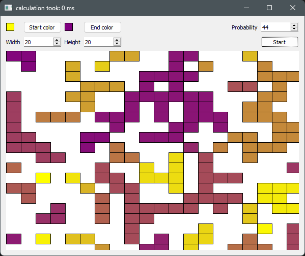

# Islands

## Synopsis
Islands is a small program that generates a 2D grid with variable size.
It then initializes the grid with random boolean values and identifies islands.
An island is a group of adjacent `true` values (exluding diagonal fields).
It then colors the islands by interpolating between two user specified colors.

## Images
